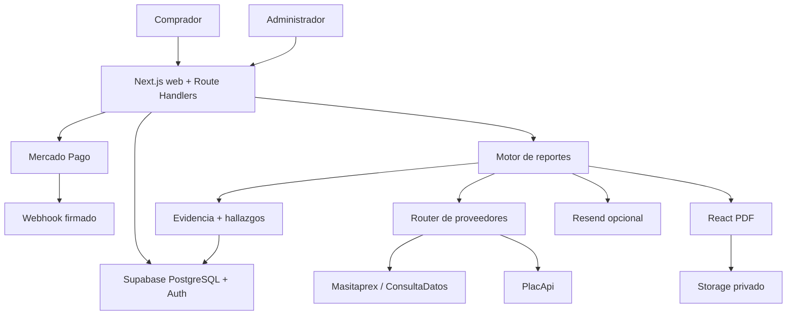

# PlacaClara — arquitectura

## Promesa y límites

PlacaClara consolida información vehicular documental disponible en Perú y muestra fuente, fecha, cobertura y limitaciones. No certifica condición mecánica, no reemplaza una certificación registral y no emite una recomendación de compra.

Arquitectura: monolito modular Next.js 16 / Node 22 / TypeScript strict, Supabase, Mercado Pago, adaptadores de proveedores, React PDF y Resend opcional.



## Capas

- `app/`: páginas y contratos HTTP.
- `components/`: presentación por superficie.
- `src/config/`: entorno, capacidades y readiness.
- `src/orders/`: ciclo de vida del pedido y autorización por cookie opaca.
- `src/payments/`: tokenización/confirmación/conciliación de Mercado Pago.
- `src/providers/`: adaptadores server-side.
- `src/evidence/`: normalización, trazabilidad y estados.
- `src/vehicle/`: orquestación del reporte canónico.
- `src/reports/`: persistencia, PDF, delivery y sharing.
- `src/analytics/`: embudo pseudónimo first-party y PostHog opcional.
- `supabase/migrations/`: historia append-only del esquema.

## Pago

El navegador tokeniza con el SDK de Mercado Pago. PlacaClara no recibe PAN/CVV. El backend:

1. fija el importe desde configuración;
2. reclama un intento idempotente;
3. crea/consulta el pago;
4. verifica estado, importe, moneda, collector y live mode;
5. persiste el intento;
6. solo marca `PAID` cuando corresponde;
7. inicia fulfillment una sola vez.

El webhook no se confía ciegamente: se valida firma y se reconcilia el pago consultando a Mercado Pago.

Los pagos TEST no pueden disparar proveedores. Un fallo posterior al cobro no transforma un pago aprobado en fallido y nunca autoriza un segundo cobro.

Yape tiene gate independiente mediante `YAPE_CHECKOUT_ENABLED`.

## Ciclo de pedido y reporte

Flujo principal:

```text
PAYMENT_PENDING
  → PAID
  → REPORT_PROCESSING
  → REPORT_READY | REPORT_PARTIAL | FAILED
```

Los caminos manuales históricos `PAYMENT_REVIEW`/Yape-Plin permanecen soportados como fallback, pero no describen el checkout principal actual.

La generación inicial consulta las fuentes habilitadas. Un refresh de un reporte existente conserva la evidencia registral y refresca únicamente las fuentes dinámicas configuradas.

El commit del reporte precede al PDF/correo. Si la entrega falla, el reporte persistido sigue siendo válido.

## Evidencia

Estados internos:

- `VERIFIED`: la fuente devolvió un dato; no significa certificación jurídica.
- `NOT_FOUND`: respuesta explícita sin registros.
- `UNAVAILABLE`: no fue posible obtener el dato.
- `NOT_CONFIGURED`: capacidad no habilitada.
- `STALE`: dato fuera de su ventana de frescura.
- `CONFLICT`: fuentes/datos incompatibles que requieren revisión.

La UI de cliente traduce estos estados a lenguaje no certificador como “Información disponible”, “Sin registros devueltos” y “No disponible”.

No se guardan domicilios de propietarios. Los documentos se enmascaran. Los payloads crudos de proveedores no forman parte del reporte canónico.

## Seguridad

- Supabase RLS en tablas operativas.
- Service role únicamente server-side.
- Admin por `app_metadata.role=admin`.
- Buckets privados.
- Mutaciones sensibles con same-origin.
- Rate limit por IP hasheada.
- Tokens/códigos opacos para pedido, reporte y sharing.
- Rutas privadas/transaccionales con `noindex` y `no-store` cuando corresponde.
- Secretos nunca versionados.

## Reporte privado y compartible

`/reporte/[publicCode]` es un enlace bearer privado y puede incluir identidad registral enmascarada.

`/compartir/[shareCode]` se construye desde un DTO allowlist sin identidad de propietarios ni datos del pedido.

PDF y redelivery reutilizan el reporte almacenado y no vuelven a consultar proveedores.

## Analítica

El embudo first-party usa un UUID pseudónimo por sesión y lo asocia al pedido mediante `orders.analytics_id`.

`analytics_events` no debe recibir placa, email, teléfono, DNI, comprobantes ni credenciales de pago. PostHog es opcional; el embudo first-party funciona sin él.

## SEO

Dominio canónico: `https://www.placaclara.com`.

La superficie pública incluye metadata, Open Graph, structured data, `robots.txt` y `sitemap.xml`. Consulta, checkout, pagos, reportes privados, administración y API no deben indexarse como páginas de adquisición.

## Operación

Los cambios de pagos, proveedores, SQL o reportes se validan primero en Preview. “READY” en Vercel solo confirma build/runtime disponible; no certifica pago, proveedores, entrega o cumplimiento.

Runbook: [docs/OPERATIONS.md](docs/OPERATIONS.md).
