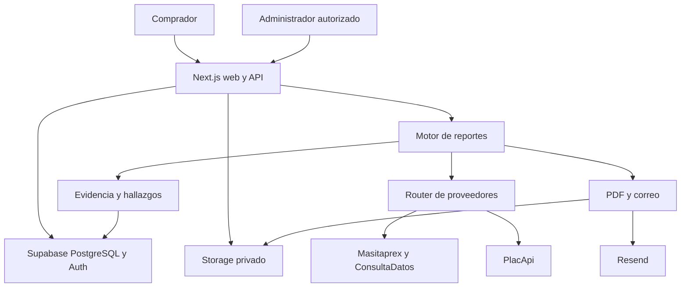

# Vehicle Intelligence PE — arquitectura

## Promesa y límites

Consolidar evidencia registral, administrativa y documental disponible de un vehículo peruano. No certificar condición mecánica ni recomendar una compra. Monolito modular Next.js App Router, Node 22+, Supabase, Resend. El pipeline no depende de React ni de una sesión del comprador.

## Dominio y persistencia

`src/providers`: HTTP con timeout de 12 segundos por intento, un reintento para errores de red/5xx; 429 solo con Retry-After de hasta 2 segundos. No reintento ordinario 4xx. Solo servidores consultan APIs. Se registra cada intento, costo estimado, latencia, estado y fingerprint sin cabeceras secretas ni payload crudo.

`src/evidence`: mapeo permitido de campos, normalización de fechas, enmascarado de documentos y trazabilidad. Respuestas desconocidas no se consideran resultados vacíos. Las estructuras registrales no reconocidas producen campos UNAVAILABLE. Se preservan múltiples titulares actuales sin contarlos como transferencias históricas.

`src/findings`: reglas deterministas; IA opcional sin nombres de propietarios ni datos personales de pago. El resultado IA es auxiliar, validado y no cambia estados ni hechos.

`src/orders`: cookie opaca HttpOnly de 256 bits por pedido, hash persistido y comparación constante. El correo es opcional para entregar, nunca requisito de cobro. terms_version, privacy_version y accepted_at se registran al aceptar las versiones mostradas; una pantalla con versiones antiguas se rechaza para evitar consentimiento equivocado. UUID del pedido por sí solo no autoriza consulta ni upload. Pago manual detrás de PaymentProvider.

`src/vehicle/service`: generateVehicleReport({plate,orderId,forceRefresh}). Consulta independiente de seguros, inspecciones, papeletas y cadena registral con Promise.allSettled. Una falla no cancela las demás.

`src/reports`: serialización canónica permitida, web y PDF generado desde la misma estructura. Link privado de 256 bits y share_code independiente creado bajo demanda; verificación reducida. Descargas protegidas por el código opaco. PDF sin datos del pago.

## Ciclo de vida

PAYMENT_PENDING → PAYMENT_REVIEW → PAID → REPORT_PROCESSING → REPORT_READY / REPORT_PARTIAL / FAILED. Rechazo solo desde PAYMENT_REVIEW y admite nuevo comprobante. approve_order y begin_report hacen transiciones atómicas en PostgreSQL. La aprobación repetida no duplica consultas. reports.order_id y vehicle_snapshots.query_id son únicos.

commit_report guarda vehículo, reporte, snapshot y estados en una transacción. La generación del PDF y correo ocurre después del commit. Si falla la entrega, el reporte sigue disponible. Reintentar entrega desde admin o descargar PDF no vuelve a consultar proveedores. Resend recibe una clave de idempotencia estable por reporte y revisión.

La ejecución se mantiene dentro del request de aprobación, con maxDuration=300. No es una cola durable: una interrupción del proceso puede dejar REPORT_PROCESSING. El administrador dispone de recuperación explícita después de REPORT_PROCESSING_STALE_MINUTES (default 10, mínimo 6 para superar maxDuration=300). Nunca se recupera automáticamente un intento fresco. El timeout efectivo depende del plan de hosting.

## Evidencia y frescura

Estados: VERIFIED, NOT_FOUND, UNAVAILABLE, NOT_CONFIGURED, STALE, CONFLICT. VERIFIED significa dato devuelto, no certificación oficial. NOT_FOUND requiere una lista vacía explícita o respuesta documentada no_encontrado. Se usa timestamp de fuente cuando viene; si no, fecha de consulta local. TTL: identidad 180 días, registro 24 h, SOAT 6 h, CITV 24 h, papeletas 1 h.

En discrepancias se conserva el primer valor según prioridad y todas las evidencias quedan marcadas CONFLICT; no hay resolución silenciosa. Certificado current: fechas vigentes en zona Lima y estado VIGENTE; historial ordenado por vencimiento, no por orden del proveedor. Reportes son snapshots, no promesas de vigencia perpetua.

Cache: reutilización conservadora del reporte canónico solo si todas las evidencias VERIFIED/NOT_FOUND siguen frescas; cualquier evidencia caducada o fallida fuerza nueva consulta. No se implementa mezcla de cachés de diferentes snapshots. Preview tiene caché separada de 1 hora y comparte el registro contable de llamadas.

## Seguridad

RLS en todas las tablas. Anon sin acceso. Authenticated solo lectura si app_metadata.role=admin; usuario autenticado no equivale a administrador. Operaciones con service role exclusivamente server-only. RPC operativas SECURITY INVOKER y EXECUTE revocado para PUBLIC/anon/authenticated. Buckets privados. Imágenes de comprobantes hasta 5 MB con firma binaria, extensión generada y nombres aleatorios. URLs firmadas del comprobante solo tras autorización de admin.

CSRF: mutaciones exigen Origin idéntico a NEXT_PUBLIC_SITE_URL. La URL se configura explícitamente en cada despliegue. Rate limit atómico por IP hasheada; Vercel usa x-vercel-forwarded-for. Fuera de Vercel, se comparte un límite conservador para evitar confiar en cabeceras falsificables. Sin DB no se llama al proveedor de preview.

No direcciones, DNI completo, payload crudo, comprobantes ni correo en analítica. Sentry recibe códigos controlados y tags, no errores crudos. Enlaces de reporte sin indexación ni referrer. No se registra la URL pública en eventos.

## Costos y salud

Costo por intento según env; PlacApi usa cost devuelto si existe. Los intentos fallidos se estiman conservadoramente; no son conciliación de factura del proveedor. provider_health_daily es una vista agregada security_invoker. Métricas administrativas: ingreso bruto de pagos aprobados, costo de todas las llamadas, costo medio por reporte y reportes del día Lima. No incluye impuestos, devoluciones, hosting, correo ni margen neto.

## Extensión

Vigilancia: snapshots existentes y cron/diff futuro. Seller report: nueva presentación del mismo modelo. B2B API: nueva autenticación y límites delante de generateVehicleReport. Pagos automáticos: implementación alternativa de PaymentProvider. No se construyen estas superficies en V0.

## Finishing batch: recuperación y exclusión de procesos antiguos

La migración 2 retira claim_report y el commit sin token. begin_report bloquea la fila del pedido, verifica paid_at, estado, antigüedad e idempotencia de request_id antes de emitir generation_token. Solo ese token puede ejecutar commit_report o registrar un fallo en orders. generation_requests conserva identificadores de solicitudes: un reintento HTTP con el mismo identificador no vuelve a consultar.

POST /api/admin/orders/[id]/reprocess requiere admin, Origin y requestId UUID. Reprocesa FAILED, PAID sin reporte y procesamiento vencido. Si existe un reporte y forceRefresh=false, recover_existing_report restaura un estado válido vencido/fallido y solo entrega. forceRefresh=true es una operación administrativa explícita que puede consumir saldo; mantiene enlaces privado/compartible, incrementa revisión, conserva snapshots y acumula costo del reporte. Un refresh fallido conserva el reporte anterior. Las solicitudes externas ya en vuelo no pueden deshacerse: el fencing evita el commit tardío, no garantiza que el proveedor no cobre el intento antiguo.

POST /api/admin/reports/[id]/redeliver no importa el router de proveedores. claim_delivery usa el bloqueo del pedido y un lease de 5 minutos; un refresh no empieza durante una entrega activa. Los archivos PDF se distinguen por revisión, y sus updates comparan revision. pdfOnly=true omite correo; SENT nunca se reenvía automáticamente. Sin Resend/remitente se guarda NOT_CONFIGURED. El estado final comercial no se revierte por fallos de PDF/correo.

## Privado y compartible

/reporte/[publicCode] y su PDF siguen siendo secretos bearer. POST /api/reports/[privateCode]/share crea share_code aleatorio de 256 bits mediante compare-and-set; no consulta proveedores. /compartir/[shareCode] usa un DTO construido campo por campo, sin reutilizar la fila de DB, owner, evidencia value/metadata ni summary IA. Solo datos documentales permitidos, estados, conteos, cobertura y fuentes. No contiene privateCode ni enlace de PDF privado. /verificar acepta cualquiera de los dos códigos y devuelve solo autenticidad reducida. No-store, noindex/nofollow y no-referrer para superficies privadas/compartibles. No hay sitemap con estos enlaces.

## Capacidades y secciones futuras

src/config/providers.ts es la fuente central de capacidades, nombre, configuración y prioridad de adaptadores. La UI comercial, CoverageList, readiness y router lo consumen. ConsultaDatos solo anuncia identidad/titular, no un historial/restricciones aún no corroborados. Robo, captura, siniestros, GNV y valorización existen en JSON como NOT_CONFIGURED, sin endpoints inventados. Estas secciones no se venden ni por sí solas fuerzan el estado parcial de las capacidades compradas. Las vistas de reportes antiguos se adaptan con upgradeReport, sin reconsultar ni cambiar snapshots almacenados.

## Identidades de propietarios

El normalizador compara nombre completo normalizado, documentos con formato coherente y fechas/títulos. Los documentos completos viven solo en un WeakMap durante el mapeo; jamás se serializan. Registros duplicados exactos se deduplican dentro de actuales e históricos, conservando eventos de titularidad distintos. Nombres reordenados, documentos inconsistentes, títulos con fechas incompatibles o identidad insuficiente producen revisión, ocultan documento no confiable y suprimen distinctOwnerCount. Nunca se fusiona por apellidos solamente. El conteo describe identidades devueltas, no el total histórico universal.

## Operación

/admin/readiness consulta configuración, DB con campos de migración 2, buckets privados y permisos de lectura; no revela valores secretos. READY TO SELL solo significa cero bloqueos de configuración detectados: la sonda y compra interna siguen siendo pasos manuales de apertura. /api/health solo devuelve booleans y versión, estado degraded si el email opcional falta.

/admin/providers/probe consulta cada adaptador, incluido fallback, con costos reales de llamadas y normalización; no guarda raw payload ni muestra propietario, domicilio o DNI. La referencia AKE473 es documentación administrativa del usuario, nunca un fallback. /api/admin/providers/golden exige admin.

PREVIEW_PROVIDER_MODE: NONE valida placa sin consulta; BASIC usa caché/PlacApi identidad; FULL permite cadena registral solo si el operador lo configura explícitamente. La respuesta sigue limitada a identidad básica. FULL no es el valor por defecto.

## Retención

Blank = sin eliminación automática. POST /api/admin/maintenance/retention es manual y protegido. execute=false calcula elegibles, execute=true elimina hasta 100 por grupo; includePdfs es opt-in. Solo comprobantes de estados terminales; antigüedad desde carga, o creación en datos antiguos. No elimina pedidos, pagos, report_json ni snapshots. REPORT_RETENTION_DAYS controla los PDF (no el JSON). Archivos PDF vencidos no se regeneran automáticamente; las rutas devuelven PDF_EXPIRED. Se conservan metadatos de borrado; no se crea cron.
